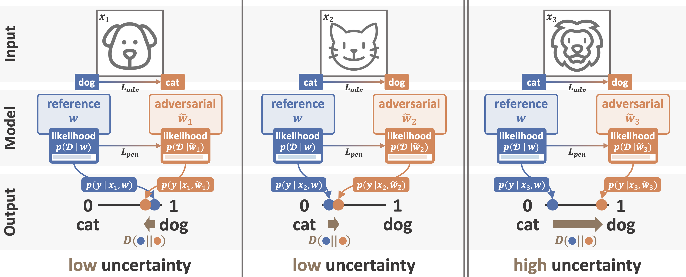

#  Quantification of Uncertainty with Adversarial Models

_Kajetan Schweighofer<sup> * 1</sup>,
Lukas Aichberger<sup> * 1</sup>,
Mykyta Ielanskyi<sup> * 1</sup>,
Günter Klambauer<sup> 1</sup>,
Sepp Hochreiter<sup> 1 2</sup>_

<sup>1</sup> ELLIS Unit Linz and LIT AI Lab, Institute for Machine Learning, Johannes Kepler University Linz, Austria  
<sup>2</sup> Institute of Advanced Research in Artificial Intelligence (IARAI)  
<sup>*</sup> Joint first author

---

This is the official repository to recreate the experiments of the paper "Quantification of Uncertainty with Adversarial Models".

The paper is available on [arxiv](https://arxiv.org/abs/2307.03217)

---

## What is QUAM?

Quantification of Uncertainty with Adversarial Models (QUAM) searches for adversarial models (not adversarial examples!) to better estimate the epistemic uncertainty, the uncertainty about chosen model parameters.
Adversarial models predict differently for a specific test point, but explain the training data similarly well. High uncertainties are detected by different adversarial models that assign a test point to different classes. As a result, the true class remains ambiguous.

<p>
  
</p>

We illustrate quantifying the predictive uncertainty of a given,
pre-selected model (blue), a classifier for images of cats and dogs. For each of the input images, we
search for adversarial models (orange) that make different predictions than the given, pre-selected
model while explaining the training data equally well (having a high likelihood). The adversarial
models found for an image of a dog or a cat still make similar predictions (low epistemic uncertainty),
while the adversarial model found for an image of a lion makes a highly different prediction (high
epistemic uncertainty), as features present in images of both cats and dogs can be utilized to classify
the image of a lion.

## Reproducing the Experiments

### Installing Dependencies

```commandline
conda install --file environment.yaml
conda activate quam
```

### Experiments on Synthetic Datasets

All experiments on synthetic datasets are available as notebooks in the [notebooks](notebooks) folder.

### Run MNIST Benchmarks

```commandline
chmod +x reproduce_mnist_experiments.sh
./reproduce_mnist_experiments.sh
```

### Run ImageNet Benchmarks

To reproduce the results for the ImageNet benchmarks, check the corresponding section in [the technical manual](TECHNICAL.md).   
